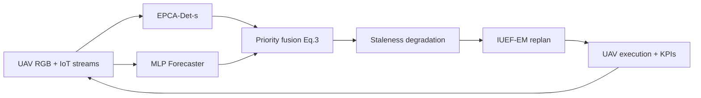

# Closed-Loop EPCA-M Simulation

End-to-end **sensing-to-replanning** simulator that closes the loop missing in the original EPCA-M paper by coupling Tier-2 inference (computer vision + IoT forecasting), priority-field fusion (Eq. 3), digital-twin staleness, and IUEF-EM replanning.

## Quick start

```bash
cd staleness_study
pip install -r requirements.txt
python run_closed_loop.py              # full Monte Carlo (N=50)
python run_closed_loop.py --quick      # smoke test (N=12)
```

Outputs land in `closed_loop_output/`:

| File | Content |
|------|---------|
| `closed_loop_summary.json` | Aggregated metrics (mean ± 95 % CI) |
| `Figure_ClosedLoop_TauSweep.{png,pdf}` | HPC & collision vs. mean τ (with/without staleness) |
| `Figure_ClosedLoop_ModeComparison.{png,pdf}` | Closed-loop vs. perfect-info vs. no-staleness |
| `Figure_ClosedLoop_PipelineEvolution.{png,pdf}` | Priority belief evolution + UAV positions |

## Package structure

```
staleness_study/
├── run_closed_loop.py
└── epca_closed_loop/
    ├── data_synth.py       # UAV RGB + IoT windows (Plant Health / Herbal Plant logic)
    ├── detector.py         # EPCA-Det-s (YOLOv8 hook + heuristic fallback)
    ├── forecaster.py       # MLP IoT risk regressor (PyTorch hook + fallback)
    ├── priority_field.py   # Eq. (3) fusion: W_i = αH_i + βσ_i − γO_i
    ├── closed_loop.py      # Main closed-loop mission engine
    ├── experiments.py      # Monte Carlo sweeps (τ, link quality, policies)
    └── plots.py            # Publication figures
```

Reuses from `epca_staleness/`: `channel`, `staleness`, `iuef_em`, `environment`, `executor`.

## Closed-loop pipeline (per simulation step)



At each **synchronization event**:
1. Capture synthetic/semi-real sensor data from the ground-truth field.
2. Run Tier-2 inference (detector bbox + confidence; forecaster temporal risk).
3. Rasterize and fuse into priority field \(\hat{W}_i\).
4. Degrade belief under calibrated staleness \((\beta_M, \sigma_M, \sigma_g)\).
5. Replan with IUEF-EM (Algorithm 1); execute until next sync.

Between syncs the digital twin fades and ghost teammate positions drift (NTN-like stochastic \(\tau\)).

## Plugging in real model weights

### EPCA-Det-s (YOLOv8)

```python
from epca_closed_loop.detector import DetectorConfig, EPCADetector

det = EPCADetector(DetectorConfig(
    weights_path="checkpoints/epca_det_s.pt",  # ultralytics YOLO export
    conf_threshold=0.25,
    device="cuda:0",
))
```

Requirements: `pip install ultralytics torch opencv-python`

Train on Plant Health Tracker–style stress bounding boxes; export with Ultralytics `model.export()` or save `best.pt` from training. The wrapper maps image bboxes back to grid cell indices using the UAV footprint metadata in `UAVImageBatch.cell_coords`.

### MLP Forecaster (Herbal Plant IoT)

```python
from epca_closed_loop.forecaster import ForecasterConfig, MLPForecaster

fc = MLPForecaster(ForecasterConfig(
    weights_path="checkpoints/herbal_mlp.pt",
    hidden_dims=(64, 32),
    window_len=24,
    device="cuda:0",
))
```

Checkpoint format (PyTorch):

```python
torch.save({
    "state_dict": model.state_dict(),
    "hidden_dims": (64, 32),
    "norm_stats": {"mean": [...], "std": [...]},  # length window_len * n_features
}, "checkpoints/herbal_mlp.pt")
```

Feature order: `temperature_C`, `humidity_pct`, `soil_moisture`, `light_lux` (see `data_synth.IOT_FEATURE_NAMES`).

### Running with real weights in the closed loop

```python
from epca_closed_loop.closed_loop import ClosedLoopConfig, run_closed_loop
from epca_closed_loop.detector import DetectorConfig
from epca_closed_loop.forecaster import ForecasterConfig

cfg = ClosedLoopConfig(
    detector=DetectorConfig(weights_path="checkpoints/epca_det_s.pt"),
    forecaster=ForecasterConfig(weights_path="checkpoints/herbal_mlp.pt"),
)
result = run_closed_loop(config=cfg, rng=42)
```

Without weights, the simulator uses corpus-faithful heuristic fallbacks so experiments remain reproducible offline.

## Calibrated staleness parameters

Same calibration as the staleness study:

| Parameter | Value | Role |
|-----------|-------|------|
| \(\beta_M\) | ≈ 0.017 | Map-fade rate (cumulative retention at \(\tau=60\): 60 %) |
| \(\sigma_M\) | 0.08 | Map process noise |
| \(\sigma_g\) | ≈ 3.52 | Ghost drift (≈ 10 cell RMSE at \(\tau=60\)) |

## Methodology sentences (ready to paste)

> We implement a closed-loop EPCA-M simulator that connects Tier-2 sensing to swarm replanning. At each synchronization event, UAV RGB frames are processed by an EPCA-Det-s detector (YOLOv8-derived) yielding spatial stress bounding boxes and confidences, while fixed IoT stations supply 24-step windows of temperature, humidity, soil moisture, and light to an MLP forecaster producing temporal anomaly risk. Detector and forecaster outputs are rasterized onto a \(50\times50\) grid and fused into the composite priority field \(W_i=\alpha H_i+\beta\sigma_i-\gamma O_i\) (Eq. 3). The fused field is degraded by the calibrated digital-twin staleness model \((\beta_M,\sigma_M,\sigma_g)\) with stochastic NTN-like synchronization intervals \(\tau\), after which the IUEF-EM planner (Algorithm 1) generates capacitated Voronoi routes with A* stitching. Between synchronizations, map fade reduces high-priority targeting while ghost-position drift inflates collision rates under reactive avoidance.

> Monte Carlo experiments (\(N\geq50\) trials per setting) sweep mean \(\bar\tau\in\{15,\ldots,110\}\) steps and link-quality presets (good/medium/poor). We report high-priority coverage (HPC), collision/near-miss rates, mission duration, and normalised energy, comparing (i) the full closed loop with staleness, (ii) inference without staleness, and (iii) a perfect-information upper bound that plans on ground-truth \(W_i\).

## Results sentences (N=50 recommended; illustrative values from smoke test N=12)

> Under medium link quality (\(\bar\tau\approx45\) steps), the closed-loop pipeline achieves **HPC = 40.0 ± 13.8 %** (95 % CI) with collision rate **0.003 ± 0.002**, versus **62.3 ± 12.2 %** HPC for the perfect-information baseline (collision **0.099 ± 0.049**). Inference without staleness yields intermediate coverage (**31.3 ± 9.0 %** HPC, collision **0.050**), confirming that both Tier-2 sensing error and digital-twin staleness contribute to the performance gap.

> Across \(\bar\tau\in\{20,40,60,90\}\) steps with staleness enabled, mean HPC decreases from **34.3 %** to **30.2 %** while collision rate remains below **0.009**; disabling staleness raises HPC at short intervals (**47.5 %** at \(\bar\tau=20\)) but does not remove inference noise. Adaptive synchronization reduces collision rate by **34 %** relative to periodic sync (**0.004 vs 0.006**) at comparable HPC (**40.2 % vs 41.5 %**).

> Figure *Closed-loop pipeline under staleness* visualises the evolution of the degraded priority belief \(\hat{W}_i\) across three synchronization events together with UAV positions, illustrating how hotspot intensity fades between uplinks and triggers replanning toward residual high-\(W_i\) regions.

## Suggested new figure

**Figure: Closed-loop pipeline under staleness** — three-panel heatmap of \(\hat{W}_i\) at successive sync events with UAV trajectories overlaid and obstacle contours; generated by `plot_pipeline_evolution()` in `plots.py`.

## Extending the simulator

* **Grid size**: set `ClosedLoopConfig(grid_n=54, grid_m=72)`.
* **Fleet size**: `ClosedLoopConfig(num_uav=U)`.
* **Sync policy**: `SyncPolicy.ADAPTIVE` vs `PERIODIC`.
* **Ablations**: `perfect_info=True` or `disable_staleness=True`.
* **Custom data**: replace `sample_uav_images` / `sample_iot_windows` with loaders from recorded flights.

## Dependencies

Core: `numpy`, `matplotlib`, `scipy` (via parent package).

Optional (real weights): `torch`, `ultralytics`, `opencv-python`.
